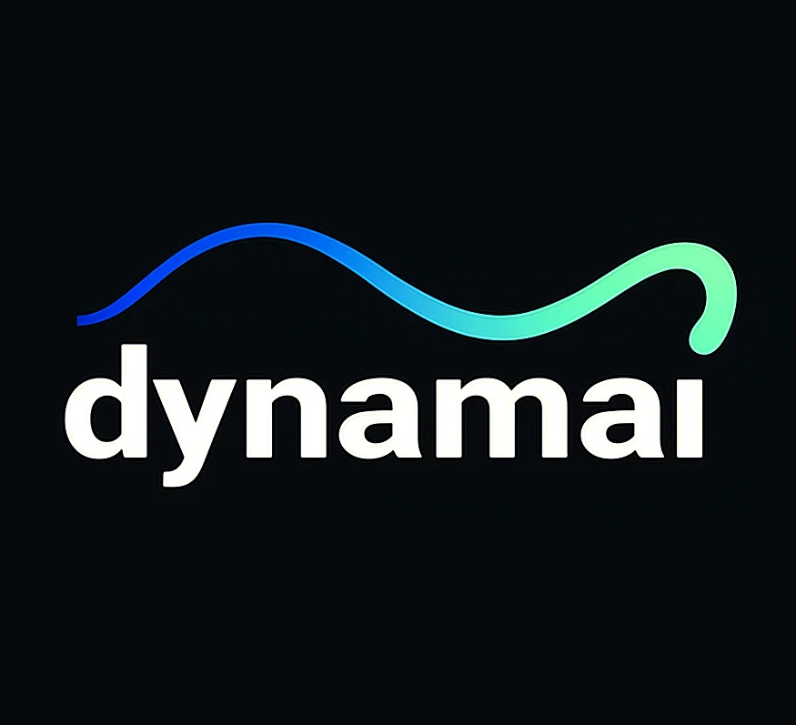

**Dynamai** is a fundamental AI research lab dedicated to advancing the intersection of complex dynamical systems and AI, bridging theory and application to drive innovation. Our main areas of interest include the foundations of generative AI and sequence modeling, robustness and reliability in ML, and AI for science. We actively collaborate with research groups and institutions around the world, partnering with leading researchers to accelerate discovery and impact. 
 

## News
📣 We are hiring a postdoc! Join our lab and help push the frontiers of the next generation of AI. Apply [here](https://academicjobsonline.org/ajo/jobs/30017).
 
📣 One paper accepted at TMLR.
 
📣 One paper accepted (spotlight) at ICLR 2025 and another one at AISTATS 2025.
 

## Funding & Support 
We acknowledge the computational resources provided by the [National Academic Infrastructure for Supercomputing in Sweden](https://www.naiss.se/) (NAISS), partially funded by the Swedish Research Council through grant agreement no. 2022-06725. We are very grateful for the funding awarded by the [Swedish Research Council](https://www.vr.se/english.html) (VR/2021-03648) and the [Wallenberg Foundations](https://www.wallenberg.org/en) (WINQ).

## Contact 
For any enquiries and comments, please contact the research director (Prof. Soon Hoe Lim) via the email address: shlim AT kth DOT se. 
