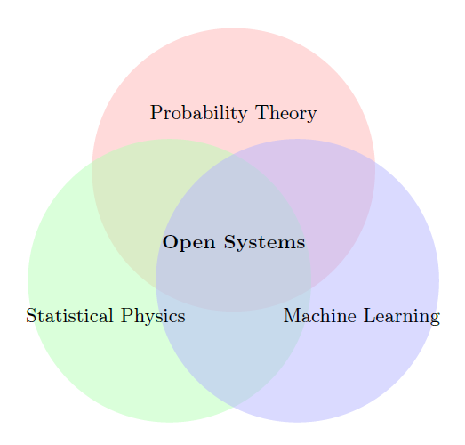

My primary research interests lie in **machine learning**, particularly at the intersection of applied probability, dynamical systems, and <a href="https://arxiv.org/abs/1312.6199"><i>modern</i> neural networks</a>. My research portfolio spans a diverse set of interconnected topics, ranging from foundational theory to algorithmic development and scientific applications. While much of my work is motivated by foundational questions, it is often closely connected to implementation challenges and a broad spectrum of practical applications across the sciences.
 

Some topics of interest include: 
- **Generative modeling:** understand and improve generative modeling methods based on dynamical measure transport, particularly for sequential data arising from dynamical systems
- **Sequence modeling:** use ideas and tools from ML and applied dynamical systems to model and learn sequential data, while also studying the mathematical foundations of these approaches
- **Optimization and sampling:** develop a deeper understanding of optimization and sampling algorithms in ML and improve them in principled ways
- **Robustness and reliability:** leverage randomness to make ML systems safer, more robust, and more reliable
- **Stochastic differential equations (SDEs):** analyze SDEs with multiple time scales through homogenization and stochastic analysis, with applications to statistical mechanics and data-driven inference of effective dynamics

<!-- Some more specific research projects are:  

At a high level, my research is inspired and driven by the following fundamental question: 

<i>Given a data set/model, a learning model and a learning algorithm, can we build a principled yet practical framework to *explore* and *exploit* the behavior of the learning model on test data, in various regimes and for various settings? </i>
 

*I also maintain a <a href="https://shoelim.github.io/DSxML/">personal journal</a> to keep track of the progress in the research areas that I am interested in.

In particular, I apply and develop ideas and tools from several areas of probability theory, stochastic analysis, statistical learning, statistical mechanics and dynamical systems to address problems concerning open dynamical systems arising in statistical mechanics and machine learning.  

Open systems are, in a broad sense, components of a larger closed system that interact with other components of the larger system. These systems abound in applications and are typically random/stochastic, nonlinear, high-dimensional and have non-trivial dynamics. Studying physical and artificial systems rigorously within an appropriate open systems framework allows us to gain valuable insights into these systems. The overarching theme of my current research revolves around using probabilistic and statistical approaches to understand <i>learning of dynamical representations</i> and <i>physics of dynamical systems</i>.    



  

 
 <i>Click on the project titles above to learn more about our work.</i> 
-->

