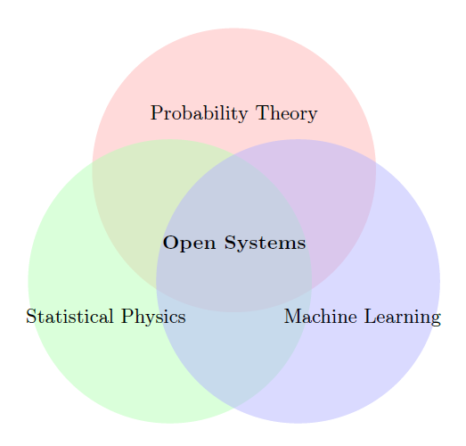

My research interests are in probabilistic and dynamical aspects of machine learning and statistical mechanics, as well as the related interactions and applications in science and engineering. In particular, I apply and develop ideas and tools from several areas of probability theory, stochastic analysis, statistical learning, statistical mechanics and dynamical systems to address problems concerning open dynamical systems arising in statistical mechanics and machine learning. Open systems are, in a broad sense, components of a larger closed system that interact with other components of the larger system. These systems abound in applications and are typically random/stochastic, nonlinear, high-dimensional and have non-trivial dynamics. The overarching theme of my research revolves around using mathematics and interdisciplinary approaches to understand <i>learning of dynamical representations</i> and <i>physics of dynamical systems</i>.

---
title: "(1) Machine learning by open dynamical systems, for open dynamical systems"
collection: portfolio
---

Recurrent neural networks (RNNs) are a class of powerful open system models in machine learning that have also enjoyed synergies with disciplines such as neuroscience, signal processing, optimization, control theory and network science. The explosion of real-time data (physical or not) and the promising potential of using complex dynamical systems (physical or not) to learn the data are opening up a wide range of foundational and practical problems. We are working on various mathematical and application aspects of RNNs and related models in deep learning. <i>Check out the relevant research outputs [here](https://shoelim.github.io/publications/).</i>
