# A FreeFM tutorial with damped oscillators and Lorenz-63

**Author:** [Soon Hoe Lim](https://shoelim.github.io/)  
**Notebook:** [`FreeFM_Tutorial.ipynb`](https://colab.research.google.com/drive/1yA9_GlwIiZVtFlZjOXWbYadckxqOvPgu?usp=sharing)

> **TL;DR.** FreeFM is a training-free, memory-based flow matching forecaster. It builds a bank of observed transition pairs, uses those pairs to define a closed-form empirical velocity field, and produces probabilistic forecasts by integrating that field. On smooth systems such as the damped harmonic oscillator, it works very well when the memory bank covers the relevant phase-space region. On chaotic systems such as Lorenz-63, short-term forecasts can be meaningful, but long-horizon pointwise matching remains fragile.

## Why FreeFM?

Most flow matching models learn a neural velocity field. FreeFM asks a simpler question:

> Can we build a probabilistic forecaster directly from observed transition pairs, without training a neural network?

The answer is **yes**, provided we understand the limitation: FreeFM does not extrapolate like a learned global model. It retrieves and blends **local transition geometry** from the data.

This makes FreeFM useful as both:

1. a lightweight forecasting baseline, and  
2. a diagnostic lens for understanding what finite-sample flow matching is doing.

## Method in one picture

Given transition pairs $(x_0^{(j)}, x_1^{(j)})$, FreeFM defines Gaussian interpolation paths

$$m_t^{(j)} = (1-t)x_0^{(j)} + t x_1^{(j)},
\qquad
c_t^2 = \sigma_{\min}^2 + \sigma^2 t(1-t).$$

The empirical flow matching velocity is

$$v(t,z) = G_t z + \sum_j \alpha_j(t,z) \left(
(x_1^{(j)}-x_0^{(j)}) - G_t m_t^{(j)} \right), \qquad
G_t = \frac{\sigma^2(1-2t)}{2c_t^2},$$

with Gaussian responsibilities

$$
\alpha_j(t,z) \propto \exp\left( -\frac{\|z-m_t^{(j)}\|^2}{2c_t^2} \right).
$$

A one-step forecast samples $Z_0 \sim \mathcal{N}(x_k,\sigma_{\min}^2I)$, then integrates $\frac{dZ_t}{dt}=v(t,Z_t),$
for $t \in [0,1]$, and returns $Z_1$ as a predictive sample for $x_{k+1}$. Repeating this autoregressively gives a probabilistic trajectory forecast.

## Two memory-bank regimes

The same FreeFM algorithm can answer two different forecasting questions depending on how the transition memory bank is constructed.

| Regime | Memory bank | Validation split | Forecasting question |
|---|---|---|---|
| **Many-trajectory/source-style** | transitions pooled from many independent trajectories | held-out trajectories | Can FreeFM forecast new trajectories from the same system? |
| **Single-trajectory/time series** | transitions from one observed path | later segment of the same path | Can FreeFM forecast the future of one path? |

This distinction is central. FreeFM is only as good as the local transition coverage in its memory bank.


## Results summary

| Experiment | Best $\sigma_{\min}$ | Best $\sigma$ | Validation CRPS | Forecast metric | Interpretation |
|---|---:|---:|---:|---:|---|
| DHO, many trajectories | 0.01 | 0.01 | 0.00255 | MSE $1.65\times 10^{-5}$ | Very strong forecast; memory bank covers the spiral well. |
| Lorenz-63, many trajectories | 0.02 | 0.01 | 0.02628 | short-window MSE $5.83\times10^{-3}$, full MSE $1.82\times10^{-1}$ | Good local behavior, but chaotic divergence appears over long horizons. |
| DHO, single trajectory | 0.03 | 0.01 | 0.00818 | MSE $1.04\times10^{-2}$ | Much harder than many-trajectory DHO because coverage is narrower. |
| Lorenz-63, single trajectory | 0.01 | 0.01 | 0.00267 | MSE $1.27\times10^{-2}$ | Short future remains close enough to observed support in this run. |


# Part I — Many-trajectory/source-style setup

In the source-style setup, we simulate multiple independent trajectories and split them by trajectory:

```python
all_seqs = make_dataset(...)
train_val_seqs = all_seqs[:-N_test]
test_seqs = all_seqs[-N_test:]
train_seqs, val_seqs = split_train_val(train_val_seqs)
```

The memory bank pools transitions across all training trajectories:

```python
X0_train, X1_train = build_memory_bank_np(train_seqs)
```

This asks whether local transition geometry from many example trajectories can forecast a new trajectory.

## Demo A: damped harmonic oscillator

The damped harmonic oscillator is a favorable sanity check: the state is two-dimensional, the phase portrait is a smooth spiral, and nearby transitions are informative.

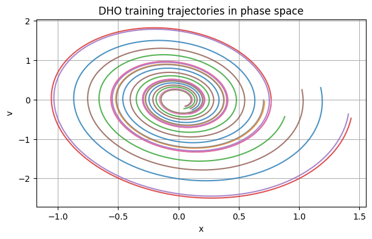

The validation search selects $\sigma_{\min}=0.01$, $\sigma=0.01.$

The held-out forecast is accurate both coordinate-wise and in phase space.

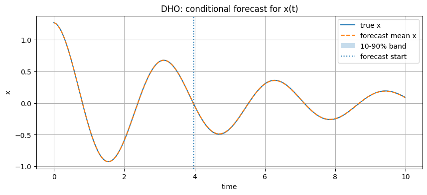

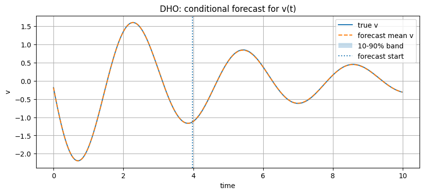

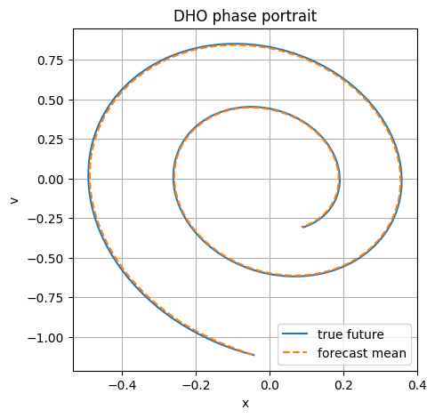

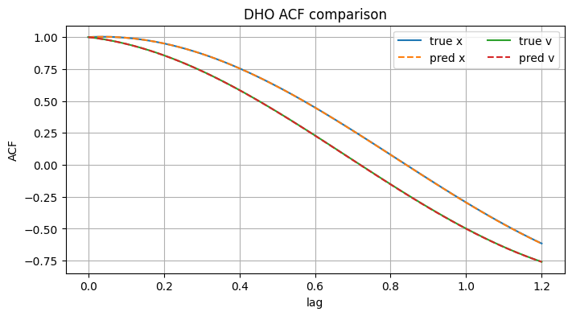

**Takeaway.** When the memory bank contains nearby spirals, FreeFM can reuse local transition directions almost exactly.


## Demo B: Lorenz-63

Lorenz-63 is a stress test because it is chaotic. Long-horizon pointwise prediction is not expected to stay synchronized indefinitely.

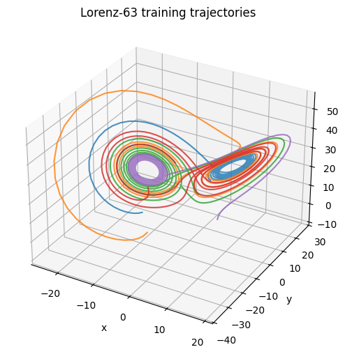

The validation search selects $\sigma_{\min}=0.02$, $\sigma=0.01.$

The short-window MSE over the first 50 forecast steps is $5.83\times 10^{-3}$, while the full-horizon MSE increases to $1.82\times 10^{-1}$.

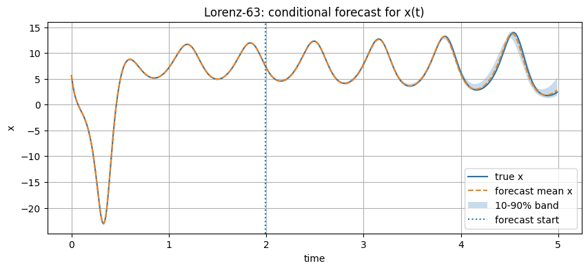

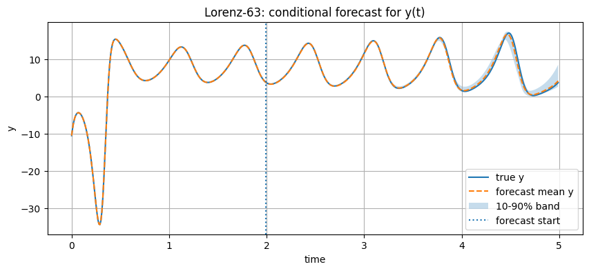

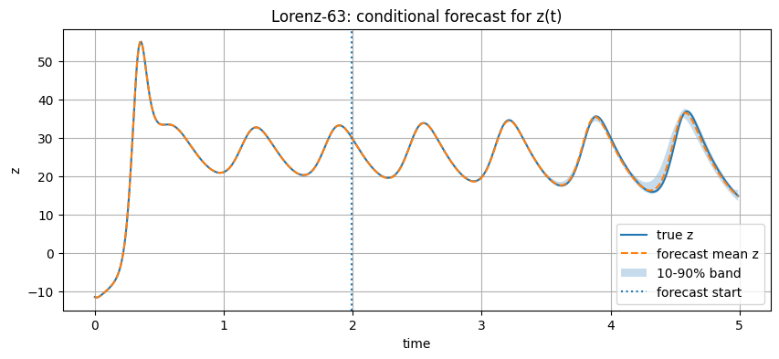

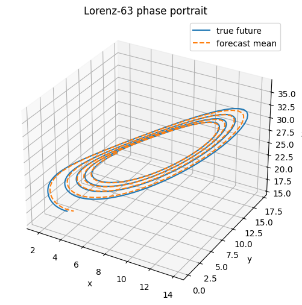

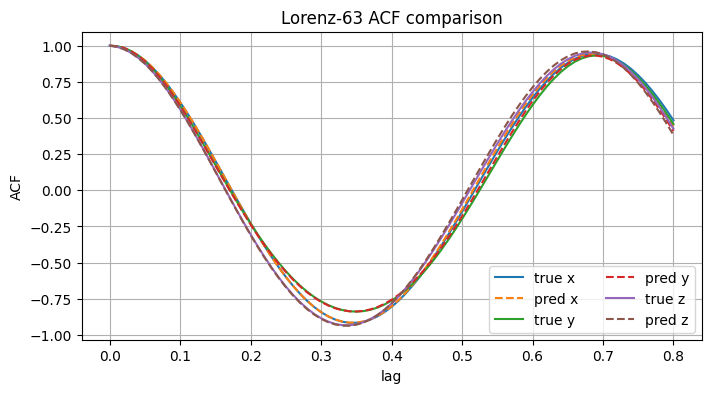

**Takeaway.** FreeFM can track local dynamics, but chaotic systems punish small autoregressive errors. Statistical and phase-space diagnostics are more meaningful than full-horizon pointwise MSE alone.


# Part II — Single-trajectory/time-series setup

The single-trajectory setup is closer to classical forecasting. We observe one ordered path $X_0,X_1,\ldots,X_{T_{\mathrm{obs}}-1},$ and forecast the held-out future $X_{T_{\mathrm{obs}}},\ldots,X_{T_{\mathrm{obs}}+H-1}.$

The observed prefix is split into training and validation segments:

```text
training segment | validation segment | held-out future
```

During validation, FreeFM uses only the training segment. After choosing $(\sigma_{\min},\sigma)$, we rebuild the final memory bank using all observed transitions before the forecast boundary.


## Single-trajectory DHO

In this regime, the memory bank comes from one observed damped spiral rather than from many independent trajectories. This is more fragile because the future may leave the observed local support.

The selected hyperparameters are $\sigma_{\min}=0.03$, $\sigma=0.01.$

The final memory bank contains 399 train-plus-validation transitions. The forecast MSE is $1.04\times10^{-2}$, with terminal error $0.309$.

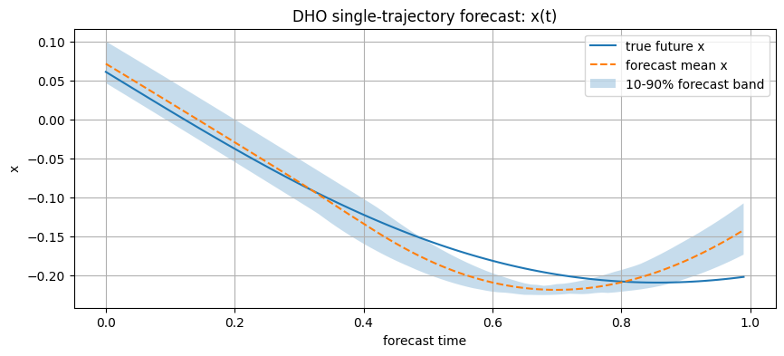

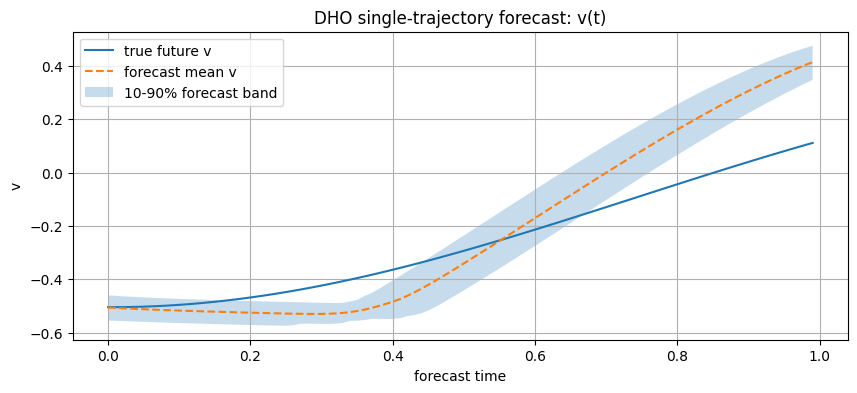

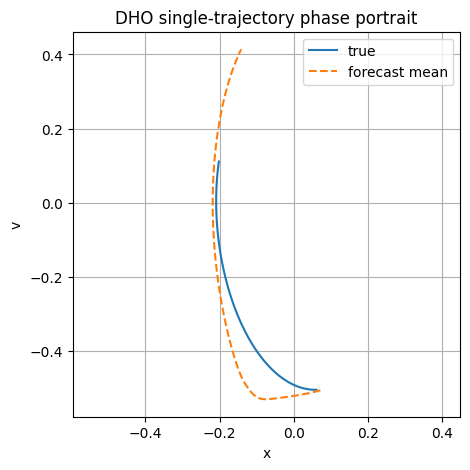

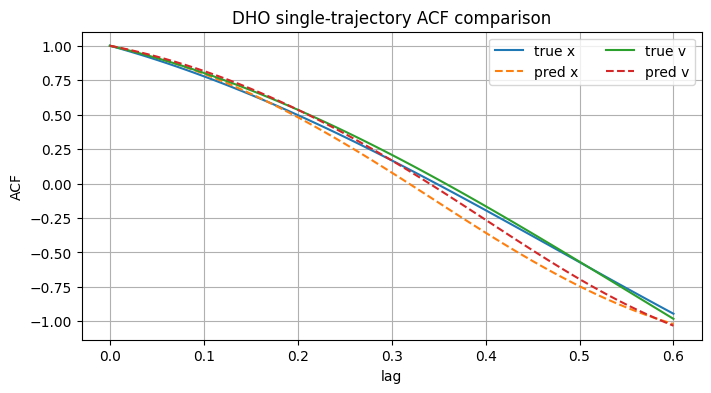


## Single-trajectory Lorenz-63

The selected hyperparameters are $\sigma_{\min}=0.01$, $\sigma=0.01.$

The final memory bank contains 399 train-plus-validation transitions. The forecast MSE is $1.27\times10^{-2}$, with terminal error $0.360$.

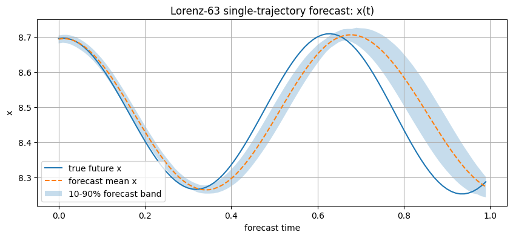

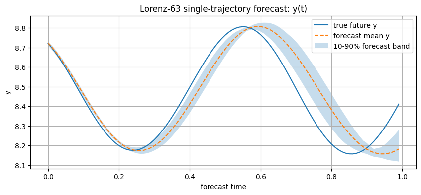

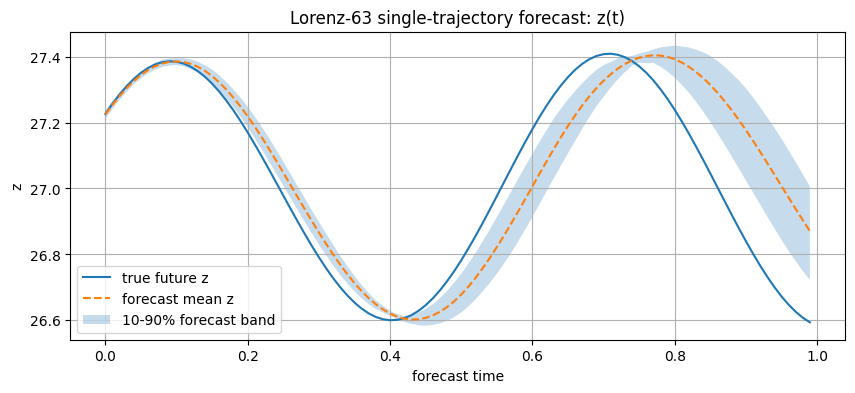

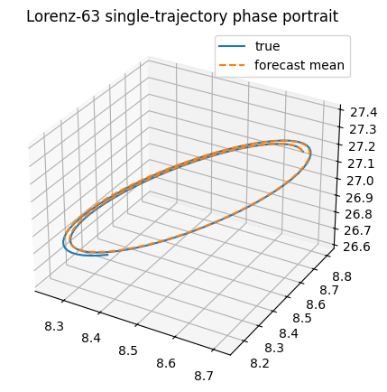

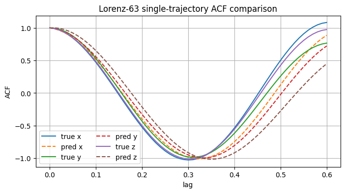


## Practical notes

- Use `topk=None` for the exact dense empirical field on small memory banks.
- Use finite `topk` for faster nearest-neighbor approximation on larger memory banks.
- Larger `topk`, more ODE steps, and RK4 can give smoother but slower forecasts.
- For Lorenz-63, exact long-horizon path matching is not expected because the system is chaotic.
- For noisy dynamical systems, inject fresh uncertainty at each autoregressive step.


## Main takeaway

FreeFM is best understood as a **memory-based flow matching forecaster**. It replaces parametric learning with local transition retrieval.

Its strengths are:

- no neural network training,
- simple implementation,
- interpretable local transition reuse,
- natural probabilistic forecasts through ensembles.

Its weaknesses are:

- dependence on memory-bank coverage,
- nearest-neighbor cost for large datasets,
- limited extrapolation outside observed support,
- long-horizon fragility on chaotic systems.

FreeFM can forecast without training, but it cannot forecast accurately without sufficient coverage. This opens an interesting direction: using FreeFM as a bridge between nonparametric memory-based forecasting and learned flow matching models for sequence data.
